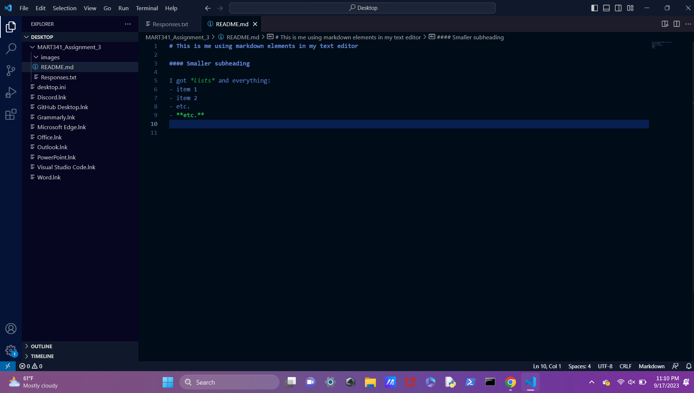

# This is me using markdown elements in my text editor

#### Smaller subheading

I got *lists* and everything:
- item 1
- item 2
- etc.
- **etc.**

[relative url link to my responses file](./Responses.txt) 
